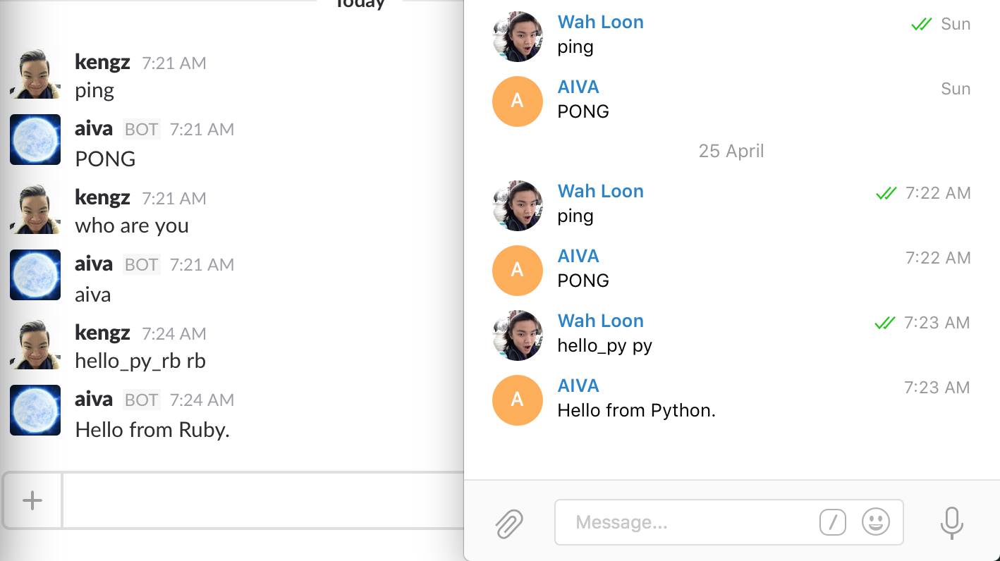

# AIVA [](https://travis-ci.org/kengz/aiva) [](https://coveralls.io/github/kengz/aiva?branch=master) [](https://gemnasium.com/kengz/jarvis) <iframe src="https://ghbtns.com/github-btn.html?user=kengz&repo=aiva&type=star&count=true" frameborder="0" scrolling="0" width="170px" height="20px"></iframe>

<aside class="warning">
This documentation is still being completed.
</aside>

**AIVA** (A.I. Virtual Assistant): General-purpose virtual assistant for developers.

It is a **bot-generalization**: you can implement any features, use it simultaneously on the major platforms, and code in multiple languages.


| AIVA is | Details |
|:---|---|
| general-purpose | An app interface, AI assistant, anything! |
| cross-platform | Deploy simultaneously on **Slack, Telegram, Facebook**, or any [hubot adapters](https://github.com/github/hubot/blob/master/docs/adapters.md) |
| multi-language | Code in and coordinate among `Node.js`, `Python`, `Ruby`, etc. |
| built-in with AI tools | Tensorflow, SkFlow, Indico.ml, spaCy, Watson, Google APIs |
| hackable | It extends [Hubot](https://github.com/github/hubot). Add your own modules! |
| powerful, easy to use | Check out [setup](#setup) and [features](#features) |

>To see what they mean, say you have a todo-list feature for AIVA, written in Node.js and leverages NLP and ML from Python. Set your todo list earlier from Slack on desktop? You can access it from Telegram or Facebook on mobile.

We see people losing a lot of time building bots instead of focusing on what they really want to do. It still requires much effort to just get a bot up and running. Moreover, the bot built is often confined to a single language, single platform, and without AI capabilities. Why choose when you can have all of it?

AIVA exists to help with that - we do the heavy-lifting and build a ready-to-use bot; it is general purpose, multi-language, cross-platform, with robust design and tests, to suite your needs. AIVA gives you powerful bot tools, saves you the time to build from scratch, and allows you to focus on what you want to do.


## Installation

1\. Fork this repo so you can pull the new releases later:

&nbsp; &nbsp; <iframe src="https://ghbtns.com/github-btn.html?user=kengz&repo=aiva&type=fork&count=true" frameborder="0" scrolling="0" width="170px" height="20px"></iframe>

2\. Clone **your forked repository**:

```shell
git clone https://github.com/YOURUSERNAME/aiva.git
```

Use **Ubuntu >14.04** or **MacOSX**; For the fastest VM setup, I recommend [Digital Ocean](https://www.digitalocean.com), with this automatic [setup script](https://github.com/kengz/mac_setup). Optionally for manual setup, see [Dependencies](#dependencies).


## <a name="setup"></a>Setup, Run

### <a name="one-time-setup"></a>One-time Setup
- **install dependencies**: (first installation may take ~20 mins, mainly due to the AI modules)

```shell
npm run gi
```

- **setup keys**: update `.env`, `bin/.key-aiva` (production), `bin/.key-aivadev` (development).

<aside class="notice">
If you prefer a different bot name, replace "aiva" from the <code>bin/.keys-</code> and in <code>package.json</code>.
</aside>


### <a name="run"></a>Run
- **run**: 

```shell
npm start # runs aiva
npm run debug # runs aivadev
```

This will start AIVA with the default hubot adapters: Slack, Telegram, Facebook. See [**Adapters**](#adapters) for connecting to different chat platforms.

>AIVA saying hi, translating, running deep neural net; on Slack, Telegram:



Check [**Setup tips**](#setup-tips) for help.

